# Authentication and Authorization

When examining the public or confidential nature of a given client, we're evaluating the ability of that client to prove its identity to the authorization server. This is important because the authorization server must be able to trust the identity of the client in order to issue access tokens.

* **Public client applications** run on devices, such as desktop, browserless APIs, mobile or client-side browser apps. They can't be trusted to safely keep application secrets, so they can only access web APIs on behalf of the user. Anytime the source or compiled bytecode of a given app is transmitted anywhere it can be read, disassembled, or otherwise inspected by untrusted parties, it's a public client. As they also only support public client flows and can't hold configuration-time secrets, they can't have client secrets.
* **Confidential client applications** run on servers, such as web apps, web API apps, or service/daemon apps. They're considered difficult to access by users or attackers, and therefore can adequately hold configuration-time secrets to assert proof of its identity. The client ID is exposed through the web browser, but the secret is passed only in the back channel and never directly exposed.

```mermaid
graph LR
  actor([🧑])
  pca[[Public Client Application - PCA]]
  cca[[Confidential Client Application - CCA]]
  
  actor --> pca
  actor --> cca
```



> IMPORTANT: Both app types SHOULD maintain a user token cache and can acquire a token silently (when the token is present in the cache).

## PCA (Graphical User Interface Flow)

We follow the [Open ID Connect (OIDC) Flow](https://openid.net/specs/openid-connect-core-1_0-final.html) for authentication and [OAuth 2.0 Token Exchange](https://datatracker.ietf.org/doc/html/rfc8693) for authorization:


## CCA (Application Programming Interface Flow)

In this pattern, a pair of values is generated by the authorization server when registering a client. The client ID is a public value that identifies the application, while the client secret is a confidential value used to prove the identity of the application. We follow the [OAuth 2.0 Client Credentials Flow](https://datatracker.ietf.org/doc/html/rfc6749#section-4.4) which is typically used for server-to-server communication and automated scripts requiring no user interaction. TL;DR; Initially:


And later:


## `access_token` payload schema

```json
{
  "type": "object",
  "properties": {
    "name": { "type": "string", "description": "User's full name, including all middle names, titles, and suffixes as appropriate, formatted for display (e.g., 'Ms. Barbara Jane Jensen, III')." },
    "email": { "type": "string", "format": "email", "description": "User's internet email address, see RFC 5321, section 4.1.2." },
    "phone": { "type": "string", "format": "tel", "description": "User's telephone number as E.164." },
    "photo": { "type": "string", "format": "uri", "description": "User's avatar as a universal resource identifier (URI), according to RFC3986." },
    "preferredLanguage": { "type": "string", "description": "Indicates the user's preferred written or spoken languages and is generally used for selecting a localized user interface." }
  },
  "required": ["name", "email"]
}
```

> IMPORTANT: Although `preferredLanguage` SHOULD be present in the `access_token` payload, it have a lower specificity than a local_storage `currentLanguage` value.

## ER-Diagram


## PBKDF Reference Implementation

```js
import { scrypt, randomBytes, timingSafeEqual } from 'node:crypto'

const DEFAULT_SALT_LENGTH = 16// NIST 800-132 minimal recommended salt length
const DEFAULT_KEY_LENGTH = 32

async function pbkdf (password, options = {}) {
  return new Promise((resolve, reject) => {
    let saltlen = options.saltlen ?? DEFAULT_SALT_LENGTH
    let keylen = options.keylen ?? DEFAULT_KEY_LENGTH
    let salt = randomBytes(saltlen)
    scrypt(password, salt, keylen, options, (err, derivedKey) => {
      if (err) reject(err)
      resolve(`${salt.toString('hex')}:${derivedKey.toString('hex')}`)
    })
  })
}

async function pbkdf_verify (password, digest, options = {}) {
  return new Promise((resolve, reject) => {
    let [salt, providedDerivedKey] = digest.split(':').map(x => Buffer.from(x, 'hex'))
    let keylen = options.keylen ?? DEFAULT_KEY_LENGTH
    scrypt(password, salt, keylen, options, (err, derivedKey) => {
      if (err) reject(err)
      resolve(timingSafeEqual(providedDerivedKey, derivedKey))
    })
  })
}

let secret_1 = await pbkdf('very_secret_password')
let secret_2 = await pbkdf('very_secret_password')

console.log(secret_1.length)

// digest MUST be different
console.log(secret_1)
console.log(secret_2)
console.log(secret_1 == secret_2)

// incoming password MUST be verifiable
console.log(await pbkdf_verify('very_secret_password', secret_1))
console.log(await pbkdf_verify('very_secret_password', secret_2))
```

## References

* [RFC2119](https://www.ietf.org/rfc/rfc2119.txt) -- Key words for use in RFCs to Indicate Requirement Levels
* [RFC6749](https://www.ietf.org/rfc/rfc6749.txt) -- The OAuth 2.0 Authorization Framework
* [RFC6750](https://www.ietf.org/rfc/rfc6750.txt) -- The OAuth 2.0 Authorization Framework: Bearer Token Usage
* [RFC7519](https://www.ietf.org/rfc/rfc7519.txt) -- JSON Web Token (JWT)
* [RFC7521](https://www.ietf.org/rfc/rfc7521.txt) -- Assertion Framework for OAuth 2.0 Client Authentication and Authorization Grants
* [RFC7523](https://www.ietf.org/rfc/rfc7523.txt) -- JSON Web Token (JWT) Profile for OAuth 2.0 Client Authentication and Authorization Grants
* [RFC8693](https://www.ietf.org/rfc/rfc8693.txt) -- OAuth 2.0 Token Exchange
* [OIDC](https://openid.net/specs/openid-connect-core-1_0-final.html) -- OpenID Connect Core 1.0 Final
* [Scrypt | Crypto | Node.js](https://nodejs.org/api/crypto.html#cryptoscryptpassword-salt-keylen-options-callback) -- crypto.scrypt(password, salt, keylen[, options], callback)
* [NIST Special Publication 800-132](https://nvlpubs.nist.gov/nistpubs/Legacy/SP/nistspecialpublication800-132.pdf) -- Recommendation for Password-Based Key Derivation
