# Identity and Resources Management

SCIM (System for Cross-domain Identity Management) is considered an industry standard for identity management and user provisioning across multiple applications and domains. It has been widely adopted by cloud service providers, SaaS applications, and enterprise solutions due to its interoperability, scalability, and ease of integration.

Many major tech companies, including Microsoft, Amazon, Google and others, have implemented SCIM in their identity and access management services. The protocol can be resumed by the following er-diagram, operations and discovery mechanism:


**Operations**

| action      | verb     | url                                                                                                                         |
|-------------|----------|-----------------------------------------------------------------------------------------------------------------------------|
| **Create**  | `POST`   | https://domain.com/:version/:resource                                                                                       |
| **Read**    | `GET`    | https://domain.com/:version/:resource/:id                                                                                   |
| **Replace** | `PUT`    | https://domain.com/:version/:resource/:id                                                                                   |
| **Delete**  | `DELETE` | https://domain.com/:version/:resource/:id                                                                                   |
| **Update**  | `PATCH`  | https://domain.com/:version/:resource/:id                                                                                   |
| **Search**  | `GET`    | https://domain.com/:version/:resource?filter={attribute}{op}{value}&sortBy={attributeName}&sortOrder={ascending\|descending} |
| **Bulk**    | `POST`   | https://domain.com/:version/Bulk                                                                                            |

**Discovery**

To simplify interoperability, SCIM provides three end points to discover supported features and specific attribute details:

| discover                                                      | verb  | url                                               |
|---------------------------------------------------------------|-------|---------------------------------------------------|
| Specification compliance, authentication schemes, data models | `GET` | https://domain.com/:version/ServiceProviderConfig |
| Types of resources available                                  | `GET` | https://domain.com/:version/ResourceTypes         |
| Resources and attribute extensions                            | `GET` | https://domain.com/:version/Schemas               |

## Extensibility

Additionally to being globally recognized and used as protocol for sharing and synchronizing Users and Groups, the specification also defines a standardized way to extend it for other resource types, providing a robust foundation for exchanging serialized data across multiple domains using REST architectural style. Because of that, we feel that's the right way to define RESTful APIs, any other attempt would introduce unnecessary complexity, duplicating what SCIM already does efficiently. This not only saves development time and resources but also ensures compatibility with existing systems and services, making integration smoother and more predictable.

## References

* [REST](https://ics.uci.edu/~fielding/pubs/dissertation/rest_arch_style.htm) -- Representational State Transfer
* [RFC3966](https://datatracker.ietf.org/doc/html/rfc3966) -- The tel URI for Telephone Numbers
* [RFC3986](https://datatracker.ietf.org/doc/html/rfc3986) -- Uniform Resource Identifier (URI): Generic Syntax
* [RFC4648](https://datatracker.ietf.org/doc/html/rfc4648) -- The Base16, Base32, and Base64 Data Encodings
* [RFC5321](https://datatracker.ietf.org/doc/html/rfc5321) -- Simple Mail Transfer Protocol
* [RFC5646](https://datatracker.ietf.org/doc/html/rfc5646) -- Tags for Identifying Languages
* [RFC6557](https://datatracker.ietf.org/doc/html/rfc6557) -- Procedures for Maintaining the Time Zone Database
* [RFC7642](https://datatracker.ietf.org/doc/html/rfc7642) -- System for Cross-domain Identity Management: Definitions, Overview, Concepts, and Requirements
* [RFC7643](https://datatracker.ietf.org/doc/html/rfc7643) -- System for Cross-domain Identity Management: Core Schema
* [RFC7644](https://datatracker.ietf.org/doc/html/rfc7644) -- System for Cross-domain Identity Management: Protocol
* [ISO639](https://www.iso.org/iso-639-language-code) -- Language code
* [ISO3166](https://www.iso.org/iso-3166-country-codes.html) -- Country Codes

# Authentication and Authorization

When examining the public or confidential nature of a given client, we're evaluating the ability of that client to prove its identity to the authorization server. This is important because the authorization server must be able to trust the identity of the client in order to issue access tokens.

```mermaid
graph LR
  actor([🧑])
  pca[["Public Client Application (PCA)"]]
  cca[["Confidential Client Application (CCA)"]]
  
  actor --> pca & cca
```



* **Public client applications** run on devices, such as desktop, browserless APIs, mobile or client-side browser apps. They can't be trusted to safely keep application secrets, so they can only access web APIs on behalf of the user. Anytime the source or compiled bytecode of a given app is transmitted anywhere it can be read, disassembled, or otherwise inspected by untrusted parties, it's a public client. As they also only support public client flows and can't hold configuration-time secrets, they can't have client secrets.
* **Confidential client applications** run on servers, such as web apps, web API apps, or service/daemon apps. They're considered difficult to access by users or attackers, and therefore can adequately hold configuration-time secrets to assert proof of its identity. The client ID is exposed through the web browser, but the secret is passed only in the back channel and never directly exposed.

> IMPORTANT: Both app types SHOULD maintain a user token cache and can acquire a token silently (when the token is present in the cache).

## Graphical User Interface Flow (PCA use case)

We follow the [Open ID Connect (OIDC) Flow](https://openid.net/specs/openid-connect-core-1_0-final.html) for authentication and [OAuth 2.0 Token Exchange](https://datatracker.ietf.org/doc/html/rfc8693) for authorization:


## Application Programming Interface Flow (CCA use case)

In this pattern, a pair of values is generated by the authorization server when registering a client. The client ID is a public value that identifies the application, while the client secret is a confidential value used to prove the identity of the application. We follow the [OAuth 2.0 Client Credentials Flow](https://datatracker.ietf.org/doc/html/rfc6749#section-4.4) which is typically used for server-to-server communication and automated scripts requiring no user interaction. TL;DR; Initially:


And later:


## `access_token` payload schema

```json
{
  "type": "object",
  "properties": {
    "name": { "type": "string", "description": "User's full name, including all middle names, titles, and suffixes as appropriate, formatted for display (e.g., 'Ms. Barbara Jane Jensen, III')." },
    "email": { "type": "string", "format": "email", "description": "User's internet email address, see RFC 5321, section 4.1.2." },
    "phone": { "type": "string", "format": "tel", "description": "User's telephone number as E.164." },
    "photo": { "type": "string", "format": "uri", "description": "User's avatar as a universal resource identifier (URI), according to RFC3986." },
    "preferredLanguage": { "type": "string", "description": "Indicates the user's preferred written or spoken languages and is generally used for selecting a localized user interface." }
  },
  "required": ["name", "email"]
}
```

> IMPORTANT: Although `preferredLanguage` SHOULD be present in the `access_token` payload, it have a lower specificity than a local_storage `currentLanguage` value.

## ER-Diagram


## PBKDF Reference Implementation

```js
import { scrypt, randomBytes, timingSafeEqual } from 'node:crypto'
import { promisify } from 'node:util'

const DEFAULT_SALT_LENGTH = 16// NIST 800-132 minimal recommended salt length
const DEFAULT_KEY_LENGTH = 32
const scryptAsync = promisify(scrypt)

async function pbkdf (password, options = {}) {
  let {
    saltlen = DEFAULT_SALT_LENGTH,
    keylen = DEFAULT_KEY_LENGTH,
    ...scryptOptions
  } = options
  let salt = randomBytes(saltlen)
  let derivedKey = await scryptAsync(password, salt, keylen, scryptOptions)
  return `${salt.toString('hex')}:${derivedKey.toString('hex')}`
}

async function pbkdf_verify (password, digest, options = {}) {
  let valid = (/^[0-9a-f]+:[0-9a-f]+$/gi).test(digest)
  if (!valid) throw new Error('INVALID_DIGEST_FORMAT')
  let [salt, providedDerivedKey] = digest.split(':').map(x => Buffer.from(x, 'hex'))
  let {
    keylen = DEFAULT_KEY_LENGTH,
    ...scryptOptions
  } = options
  let derivedKey = await scryptAsync(password, salt, keylen, scryptOptions)
  return timingSafeEqual(providedDerivedKey, derivedKey)
}

let secret_1 = await pbkdf('very_secret_password')
let secret_2 = await pbkdf('very_secret_password')

console.log(secret_1.length)

// digest MUST be different
console.log(secret_1)
console.log(secret_2)
console.log(secret_1 == secret_2)

// incoming password MUST be verifiable
console.log(await pbkdf_verify('very_secret_password', secret_1))
console.log(await pbkdf_verify('very_secret_password', secret_2))
```

## References

* [RFC2119](https://www.ietf.org/rfc/rfc2119.txt) -- Key words for use in RFCs to Indicate Requirement Levels
* [RFC6749](https://www.ietf.org/rfc/rfc6749.txt) -- The OAuth 2.0 Authorization Framework
* [RFC6750](https://www.ietf.org/rfc/rfc6750.txt) -- The OAuth 2.0 Authorization Framework: Bearer Token Usage
* [RFC7519](https://www.ietf.org/rfc/rfc7519.txt) -- JSON Web Token (JWT)
* [RFC7521](https://www.ietf.org/rfc/rfc7521.txt) -- Assertion Framework for OAuth 2.0 Client Authentication and Authorization Grants
* [RFC7523](https://www.ietf.org/rfc/rfc7523.txt) -- JSON Web Token (JWT) Profile for OAuth 2.0 Client Authentication and Authorization Grants
* [RFC8693](https://www.ietf.org/rfc/rfc8693.txt) -- OAuth 2.0 Token Exchange
* [OIDC](https://openid.net/specs/openid-connect-core-1_0-final.html) -- OpenID Connect Core 1.0 Final
* [Scrypt | Crypto | Node.js](https://nodejs.org/api/crypto.html#cryptoscryptpassword-salt-keylen-options-callback) -- crypto.scrypt(password, salt, keylen[, options], callback)
* [NIST Special Publication 800-132](https://nvlpubs.nist.gov/nistpubs/Legacy/SP/nistspecialpublication800-132.pdf) -- Recommendation for Password-Based Key Derivation

# Access Control

Relying solely on OAuth2 scopes and claims from an OpenID Provider to manage detailed access control introduces significant complexity and potential security risks. Implementing RBAC at the Service Provider level offers a more manageable, flexible, and secure approach to access control. It allows the SP to efficiently handle dynamic access requirements, enforce fine-grained policies, and maintain optimal system performance, all while keeping authentication concerns separate from authorization. RBAC TL;DR:

```mermaid
graph LR
  alice(👩 Alice)
  bob(🧑 Bob)
  charlie(👨 Charlie)
  role([Role: End User])
  documents[[Documents 📃]]
  cases[[Cases 🗃️]]
  resource[[Resources 📦]]

  alice & bob & charlie -->|member of| role
  role -->|allowed to create| documents
  role -->|allowed to manage| cases
  role -->|execute a transaction with| resource
```



With each microservice implementing it's own RBAC, we are addressing the following problems:

1. Scalability Challenges:
    - **Explosion of Scopes**: Each unique resource and action pair would require its own scope or claim. In complex systems with numerous resources and actions, this leads to an unwieldy number of scopes.
    - **Management Overhead**: Keeping track of and maintaining these numerous scopes becomes increasingly difficult, leading to potential errors and security risks.
1. Token Size and Performance:
    - **Large Tokens**: Embedding all resource claims in tokens can significantly increase their size, impacting network performance and increasing latency.
    - **Processing Load**: Larger tokens require more processing power to decode and validate, which can degrade system performance.
1. Dynamic Access Requirements:
    - **Inflexibility**: OAuth2 scopes are typically static and defined at the OpenID Provider (OP). Adapting to changing business requirements would necessitate frequent updates to the OP's configuration.
    - **Deployment Bottlenecks**: Every change in access control might require redeploying or reconfiguring the OP, causing delays and potential downtime.
1. Security Risks:
    - **Over-Privileged Tokens**: Assigning broad scopes to cover multiple resource pairs can result in tokens that grant more permissions than necessary, violating the principle of least privilege.
    - **Exposure of Sensitive Information**: Detailed claims about resources and actions within tokens could expose sensitive information if tokens are intercepted.
1. Complex Policy Enforcement:
    - **Lack of Contextual Decision-Making**: OAuth2 scopes do not easily support contextual access decisions based on dynamic attributes like time, location, or device posture.
    - **Difficulty in Implementing Fine-Grained Policies**: Enforcing complex business logic through scopes and claims is impractical and error-prone.

It's important to note that by following this pattern, we are also increasing the separation of concerns 

## ER-Diagram


## RBAC Reference Implementation

Because [Casbin](https://casbin.org/) is a battle tested library with support for many [programming languages, runtimes](https://casbin.org/docs/overview#languages-supported-by-casbin) and [storage adapters](https://casbin.org/docs/adapters#supported-adapters), we leverage it as our RBAC with domains/tenants model and policy:

```ini
[request_definition]
r = sub, dom, obj, act

[policy_definition]
p = sub, dom, obj, act

[role_definition]
g = _, _, _

[policy_effect]
e = some(where (p.eft == allow))

[matchers]
m = g(r.sub, p.sub, r.dom) && r.dom == p.dom && r.obj == p.obj && r.act == p.act
```

```csv
p, admin, looplex.com.br, documents, read
p, admin, looplex.com.br, documents, write
p, admin, domain.com, documents, read
p, admin, domain.com, documents, write

g, alice, admin, looplex.com.br
g, bob, admin, domain.com
```

**Usage:**

Request: `alice, looplex.com.br, documents, read`
Result: `true`, because of `["admin","looplex.com.br","documents","read"]`

## References

* [RBAC](https://csrc.nist.gov/files/pubs/conference/1992/10/13/rolebased-access-controls/final/docs/ferraiolo-kuhn-92.pdf) -- Role Based Access Controls
* [Naming and grouping privileges to simplify security management in large databases](https://ieeexplore.ieee.org/document/63844)
* [Casbin](https://casbin.org/docs/get-started) -- An authorization library that supports access control models like ACL, RBAC, ABAC
